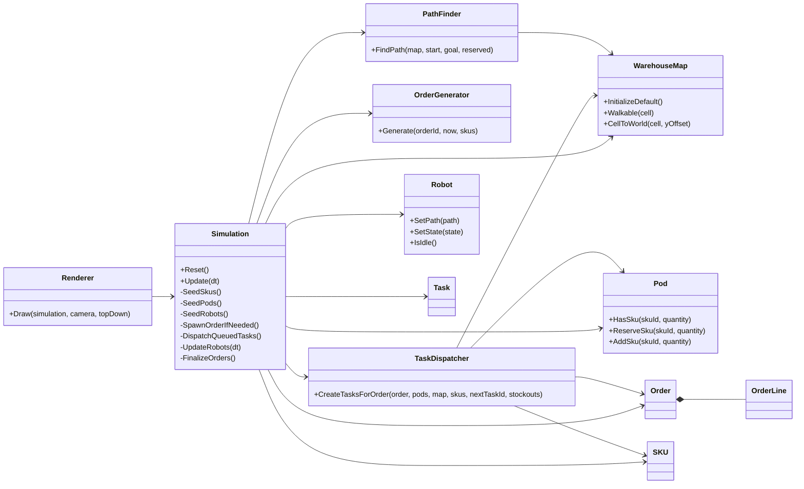

# Warehouse Inventory Simulation (raylib + C++)

https://github.com/user-attachments/assets/4fa126aa-4142-4916-8d48-fdd59c958bf3

This project is now a goods-to-person warehouse simulator inspired by Amazon/Kiva-style systems.

The key flow is:

- Orders arrive with SKU demand
- The dispatcher selects a grey shelf that contains the requested SKU
- The dispatcher chooses the best pick station for that shelf
- A Kiva-style robot drives under the shelf
- The robot carries the whole shelf to the station
- The item is picked from the shelf at the station
- The shelf is returned to its home storage slot

## How inventory management works

Inventory is tracked at the pod level instead of as a single flat stock count.

- `SKU` describes the item itself: name, weight, volume, demand class, and demand weight.
- `Pod` is the movable grey shelf that physically holds multiple SKUs.
- `Order` contains the customer demand lines.
- `Task` is created for each order line after the system chooses the best pod.
- `Robot` moves the chosen pod from storage to the station and then returns it home.

The simulation starts by seeding many SKUs and then distributing them across many movable shelves. Each shelf is a real storage location with its own inventory map, so the system always knows which shelf contains which SKU and how many units remain there.

When an order arrives, the dispatcher looks through all shelves that contain the requested SKU and selects the best one. A shelf is reserved while a robot is handling it so two robots do not target the same shelf. If no shelf can satisfy the request, the system records a stockout.

## How storage optimization works

The storage strategy is a simplified goods-to-person slotting policy.

- Fast-moving SKUs get higher demand weights.
- Movable shelves are placed in rack cells in the warehouse grid.
- When choosing a shelf for a line item, the dispatcher scores each candidate using a weighted cost.

The current score is based on:

- Distance from the nearest/best pick station to the shelf
- How much of the requested SKU is already available in that shelf
- The SKU velocity class

In practice, this means the system prefers shelves that are close to one of the available pick stations, contain enough quantity, and hold items that are important to the flow. That is the optimization layer that reduces unnecessary robot travel and keeps high-demand items easier to reach.

Inventory is periodically replenished so the simulation can keep running instead of drying up after the first stock wave.

The simulation does not yet do full enterprise slotting, but the architecture is already set up for it. You can later replace the simple weighted score with a more advanced policy such as ABC zoning, congestion-aware scoring, or periodic re-slotting.

## Features implemented

- 3D warehouse with aisles, racks, six pick stations, movable shelves, and robots
- Fourteen Kiva-style robots
- Walkable grid with blocked rack columns
- SKU catalog with ABC demand classes
- Pods that store inventory and get moved by robots
- Random order generation based on weighted demand
- Task generation and assignment to nearest idle robot
- A* routing from robot -> pod -> station -> home
- Basic congestion handling with occupied-cell checks
- Live HUD metrics:
  - Orders completed
  - Orders in queue
  - Tasks completed
  - Average travel per task
  - Average order cycle time
  - Stockout events

## Controls

- `W/A/S/D`: move camera
- `Q/E`: up/down camera
- Mouse + right button: look around
- `R`: reset simulation
- `TAB`: toggle top-down camera

The grey rack-like boxes are the movable shelves. When a robot receives a command, it drives under one of those shelves, carries the whole shelf to the pick station, waits for the simulated pick to complete, and then stores the shelf back in its original slot.

## Code structure

- `GridPos.*`: grid coordinate helpers
- `WarehouseMap.*`: warehouse layout and world conversion
- `PathFinder.*`: A* routing
- `Pod.*`: pod inventory and carrying state
- `Robot.*`: robot state and movement data
- `Order.*`, `OrderLine.h`, `SKU.h`: domain models
- `OrderGenerator.*`: demand-based order creation
- `Task.*`, `TaskDispatcher.*`: pod selection and task creation
- `Simulation.*`: orchestration and update loop
- `Renderer.*`: raylib 3D rendering and HUD

## Class relationship graph



## Build

```bash
cmake -S . -B build
cmake --build build --config Release
```

## Run

```bash
./build/warehouse_sim
```

On Windows with multi-config generators, run the executable from:

```bash
build/Release/warehouse_sim.exe
```

## Notes

This is intentionally an MVP architecture. Next upgrades:

- Better pod slotting objective and periodic re-slot optimization
- Batch picking and wave planning
- Multi-agent time reservation (MAPF)
- Data import/export from SQLite or JSON
